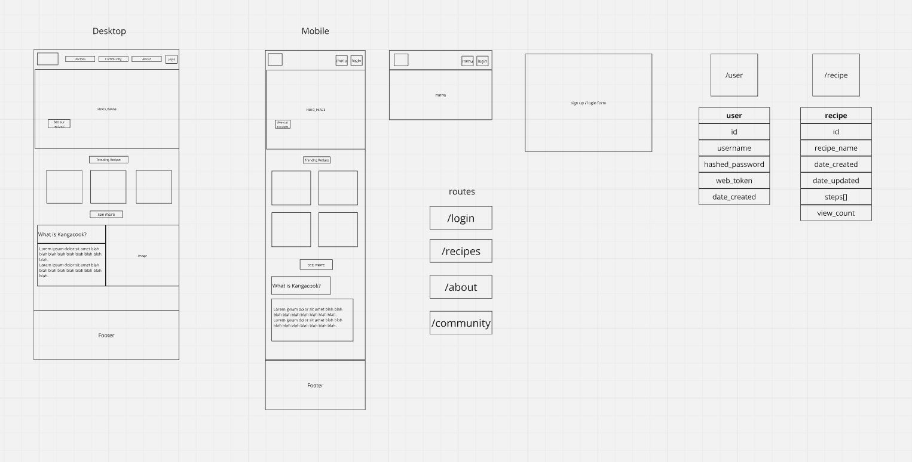

# online-assessment-client

## Description

Example client for online assessment project using Vite, React, TailwindCSS, React-Router, and Axios.

[Deployed Site](https://warm-blancmange-a405eb.netlify.app/) 
(note backend is hosted on free-tier so may take some time to spin up. if content does not show, try refreshing after a minute or so)

## Features
* Fully responsive, mobile-first design for a variety of devices.
* Example of GET requests with test data showing different recipe cards.
* Example of PUT requests with a button that updates "view count" when clicked.

## Design Wireframe
This is the initial design that was referenced during development. Not all planned features were able to be completed/used prior to deadline.

### Credits

Images from Unsplash by:
Dennis Zhang, Max Griss, Juan Encalada, Javier Esteban, Zoshua Colah, Mae Mu
